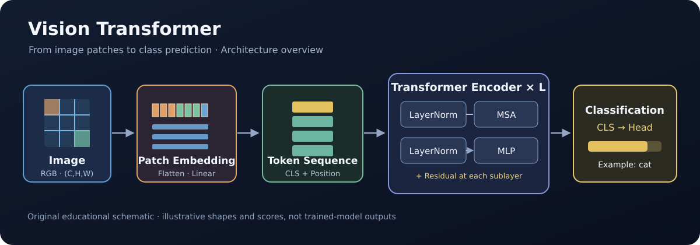

# Research Visualizations

> **논문 속 모델 구조와 수학적 연산을 애니메이션으로 이해하는 연구 시각화 프로젝트**

[](https://www.manim.community/)




*ViT 전체 구조를 설명하기 위한 자체 제작 도식입니다. 실제 영상 캡처나 학습된 모델의 출력은 아닙니다.*

**Research Visualizations**는 Deep Learning, Computer Vision, Robotics 분야의 논문과 핵심 알고리즘을 **Manim** 애니메이션으로 시각화하는 프로젝트입니다.

현재는 **Vision Transformer (ViT)** 를 중심으로, 논문 Figure에서 보여주는 전체 모델 구조와 실제 연산 과정을 순서대로 연결하는 교육용 영상을 개발하고 있습니다.

## 주요 특징

- **논문 중심 설명** — 원문 Figure와 수식에 근거해 모델 구조 및 Tensor Shape을 표현합니다.
- **연산 과정 시각화** — Patch Flatten, Linear Projection, Dot Product, Softmax, Concat, Residual Addition을 단계별로 보여줍니다.
- **맥락을 유지하는 전환** — 전체 Architecture에서 현재 설명 중인 부분을 강조하고, 필요한 Tensor 객체는 다음 단계까지 이어갑니다.
- **한국어 설명** — 기술 용어는 영어로 유지하고 핵심 개념은 짧은 한국어 자막으로 설명합니다.
- **재현 가능한 실행 환경** — Docker Compose와 `uv`로 개발 환경을 구성합니다.

> [!NOTE]
> 현재 공개된 애니메이션은 학습 및 설명을 위한 **개발 중인 시각화**입니다. 색상으로 표현한 Tensor, 일부 Attention Weight, 수치 예시, Class Probability는 학습된 모델의 실제 추론 결과가 아닙니다.

## 현재 콘텐츠 — Vision Transformer

**Scene:** `ViTFullPipeline`

| 구간 | 주요 내용 |
| --- | --- |
| 전체 구조 | Figure 1을 참고한 ViT Architecture Overview와 단계별 위치 표시 |
| Patch Embedding | RGB Channel, Patch Partition, Flatten, Linear Projection |
| Token 준비 | CLS Token 추가, Positional Embedding |
| Self-Attention | Q/K/V Projection, Dot Product, Scaled Attention, Softmax, Value Weighted Sum |
| Multi-Head | 병렬 Head, Feature Dimension Concat, Output Projection |
| Transformer Encoder | LayerNorm, Multi-Head Self-Attention, MLP, Residual Connection |
| Classification | 최종 CLS Token, 분류 Head, 예시 Class Probability |

애니메이션은 이해를 돕기 위해 작은 예시 Tensor Shape과 숫자를 사용합니다. 실제 ViT의 모든 계층을 그대로 계산하거나 학습하는 구현은 아닙니다.

## 빠른 시작

### 1. 요구 환경

- Git
- Docker Engine
- Docker Compose Plugin (`docker compose`)

호스트에 Python이나 Manim을 별도로 설치할 필요는 없습니다. 컨테이너는 **Ubuntu 24.04** 기반이며 프로젝트의 Python 요구 버전은 **3.12**입니다.

### 2. 저장소 복제

```bash
git clone https://github.com/nayana224/research-visualizations.git
cd research-visualizations
```

### 3. Docker 이미지 빌드 및 의존성 설치

```bash
docker compose build
docker compose run --rm manim uv sync
```

### 4. ViT 영상 렌더링

```bash
docker compose run --rm manim \
  uv run manim scenes/vit/vit_full.py ViTFullPipeline
```

기본 렌더링 설정은 `manim.cfg`의 `medium_quality`로, **720p / 30fps**입니다.

**생성 파일:**

```text
media/videos/vit_full/720p30/ViTFullPipeline.mp4
```

Ubuntu 환경에서는 다음 명령으로 재생할 수 있습니다.

```bash
xdg-open media/videos/vit_full/720p30/ViTFullPipeline.mp4
```

빠른 미리보기가 필요하다면 렌더 명령에서 `manim` 다음에 `-ql`을 추가할 수 있습니다. 고화질 렌더는 `-qh`를 사용합니다. 옵션에 따라 영상의 출력 폴더는 달라질 수 있습니다.

## 프로젝트 구조

```text
research-visualizations/
├── scenes/
│   └── vit/
│       └── vit_full.py               # ViT 통합 애니메이션
├── references/
│   └── papers/                       # 참고 논문 PDF
├── docker/
│   └── Dockerfile                    # 렌더링 환경
├── compose.yaml                      # Docker Compose 설정
├── manim.cfg                         # 기본 영상 품질
├── pyproject.toml                    # Python 프로젝트 및 의존성
├── AGENTS.md                         # 애니메이션 설계·검증 지침
└── README.md
```

렌더링으로 생성되는 `media/` 파일은 Git에서 제외합니다. 컨테이너의 Python 가상환경과 `uv` 캐시는 Docker named volume을 사용합니다.

## 참고 논문

시각화의 내용은 다음 원문을 우선 기준으로 삼습니다.

| 논문 | 주요 참고 내용 |
| --- | --- |
| [An Image Is Worth 16x16 Words: Transformers for Image Recognition at Scale](https://arxiv.org/abs/2010.11929) | ViT 전체 구조, Patch Embedding, CLS Token, Encoder |
| [Attention Is All You Need](https://arxiv.org/abs/1706.03762) | Scaled Dot-Product Attention, Multi-Head Attention, Transformer 연산 |

저장소에도 해당 논문을 `references/papers/05_VisionTransformer_ViT_2020.pdf`, `references/papers/04_AttentionIsAllYouNeed_2017.pdf` 경로로 보관하고 있습니다.

교육용 연출 참고: [manimgl-imcommit](https://github.com/CodingVillainKor/manimgl-imcommit) — 원소 단위 연산, Tensor 이동, 시선 유도 방식 등을 참고했습니다. 본 프로젝트는 **Manim Community Edition**을 사용하며 ManimGL 또는 `raenimgl`에 의존하지 않습니다.

## 개발 원칙 및 유의사항

1. 전체 Architecture를 먼저 제시하고, 현재 설명 중인 부분을 분명하게 표시합니다.
2. 단순히 입력과 결과를 나열하지 않고 **실제 연산 관계**를 단계적으로 표현합니다.
3. 논문의 수식과 **설명을 위해 축소한 수치 예시**를 명확히 구분합니다.
4. Tensor Shape, Attention 연산 순서, Residual Connection의 수학적 의미를 유지합니다.
5. 렌더링 후 텍스트, 화살표, 객체 간 겹침과 화면 경계 잘림을 확인합니다.

세부 제작 지침은 [AGENTS.md](AGENTS.md)에 정리되어 있습니다.

> [!IMPORTANT]
> 저장소의 코드와 설정은 변경될 수 있습니다. 모든 환경에서 렌더링이 검증된 배포 버전은 아니며, 문제가 발견되면 [GitHub Issues](https://github.com/nayana224/research-visualizations/issues)에 재현 명령과 로그를 남겨주세요.

## 라이선스

별도의 라이선스 파일은 아직 제공되지 않습니다. 참고 논문과 외부 프로젝트의 저작권 및 라이선스는 각각의 원저작자에게 귀속됩니다.
